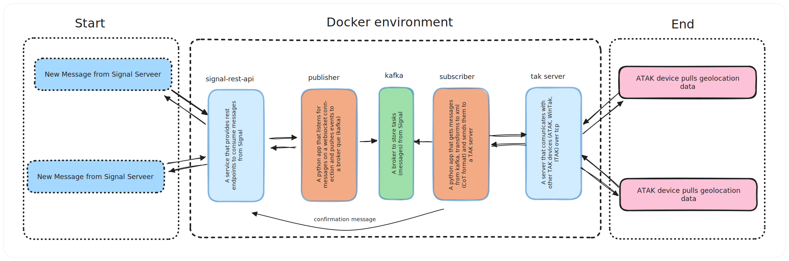

# Signal Bot with ATAK Integration 

[](https://www.python.org/downloads/release/python-3120/)

A Signal bot that sends geolocation and target information (CoT) to an ATAK (Android Team Awareness Kit) client. Dockerized and ready to be operational in minutes. Built with Docker, Docker Compose, Python, [Confluent Kafka](https://github.com/confluentinc/confluent-kafka-python), and [Signal CLI REST API](https://github.com/bbernhard/signal-cli-rest-api).
## High-Level Architecture

The project uses a **Pub/Sub pattern** and **microservice architecture**. It comprises five services:

- **`signal-rest-api`**: Provides REST endpoints to consume messages from Signal.
- **`signal-listener-publisher`**: A Python app that listens for messages on a WebSocket connection and pushes events to a Kafka queue.
- **`kafka`**: Acts as a broker to store tasks (messages) from Signal.
- **`subscriber-cot-sender`**: A Python app that retrieves messages from Kafka, transforms them to XML (CoT format), and sends them to a TAK server.
- **`tak-server`**: A server that communicates with ATAK devices (ATAK, WinTAK, iTAK) over TCP.



## Tools used


Docker related:
- [Docker](https://www.docker.com/) and [docker-compose](https://github.com/docker/compose) for containerization and orchestration
- [signal-cli-rest-api docker image](https://hub.docker.com/r/bbernhard/signal-cli-rest-api) to comunicate with Signal servers and get messages
- [confluent kafka docker image](https://hub.docker.com/r/confluentinc/cp-kafka) as a brocker setup and comunication betwen sevices
- [taky](https://github.com/tkuester/taky) for comunication with ATAK clients
- [kafka-ui docker image](https://hub.docker.com/r/provectuslabs/kafka-ui) for monitoring kafka in development
- [dozzle docker image](https://hub.docker.com/r/amir20/dozzle) for monitoring docker containers, logging

Python related:
- [confluent-kafka-python](https://github.com/confluentinc/confluent-kafka-python) for kafka comunication
- [aiohttp]() to manage async http and websocket conections
- [pytest](https://pypi.org/project/pytest/) to create test
- [watchdog](https://pypi.org/project/watchdog/) for hot reload during development 
- [uv](https://github.com/astral-sh/uv) for package and project managment
- [ruff](https://github.com/astral-sh/ruff) linter and code formatter
## Design Philosophy

This project uses a **Pub/Sub microservice architecture** to ensure **modularity**, **scalability**, and **resilience**. **Kafka** acts as the central **message broker**, decoupling services and enabling **asynchronous communication**. Each service handles a specific task, making the system easier to **develop**, **test**, and **maintain**. **Docker** and **Docker Compose** provide consistent environments, simplifying **deployment** and **scaling**. This architecture allows **independent scaling** of services, efficient handling of **high-throughput messaging**, and **fault tolerance**, as services can recover or restart without affecting the entire system. By isolating functionality, it’s easier to **extend** the system with new **features** or **integrations** in the future.

## Steps to Run the Project

Follow these steps to set up and run the project.

#### Prerequisites
1. Install [Docker](https://www.docker.com/get-started) and [Docker Compose](https://docs.docker.com/compose/install/).

   For this project yoy will need:
- **Docker Engine**: 19.03.0 or later
- **Docker Compose**: 1.27.0 or later


#### Setup and Run
1. Clone the repository and navigate into the project directory:
   ```bash
   git clone https://github.com/v-fol/atak-signal-bot.git
   cd atak-signal-bot
   ```

2. Edit the `.env` file and add your Signal phone number.
   ```bash
   # Example
   BOT_PHONE_NUMBER=+38099999999
   ```
   For other environment settings look `docs/ENV.MD`

3. Build and start the Docker containers:
   ```bash
   docker compose up --build
   ```
   - If you are using Docker Compose version 2 or later, you can use `docker compose` (without a hyphen).  
   - For older versions of Docker Compose, use the hyphenated command:
     ```bash
     docker-compose up --build
     ```

4. Open the following URL in your browser to register your device with Signal.
   ```
   http://localhost:8080/v1/qrcodelink?device_name=signal-api
   ```
   Open Signal on your mobile phone, go to Settings > Linked devices and scan the QR code using the + button.

5. Determine your local IP address to configure the TAK client:
   - **Linux**: Run `hostname -I` or `ip a` in the terminal. The IP address will typically be under `inet` for your active network interface.  
   - **Windows**: Open Command Prompt or PowerShell and run `ipconfig`. Look for the "IPv4 Address" under your active network adapter.  
   - **MacOS**: Open Terminal and run `ifconfig`. Your IP address will be listed under your active interface (e.g., `en0` or `en1`) next to `inet`.

6. In the ATAK client, navigate to **Settings > Network Preferences > TAK Server**, and add a new TAK server with the following details:
   - **IP**: Use the local IP address from step 5.
   - **Port**: `8087`
   - **Connection Type**: `TCP`

   This step connects your ATAK client to the TAK server running in the project.

   Now the project should be up and running, and the ATAK client will start receiving CoT events from the system!

7. Now you can test the bot, send a message in Signal to your number you entered in step 2. from another account in format - <lat> <lon> <name> (latitude, longitude, name separated with sapces) for example:
   ```bash
   40.7128 74.0060 Tank
   40.7128 -74.0060 New trench
   ```
   **You should see a marker in your ATAK client on thouse coordinates**
## Demo
[Watch the demo video](https://private-user-images.githubusercontent.com/72522652/392845283-b5d08216-9e76-4a7d-9ca6-5bfb9234cfcd.mp4?jwt=eyJhbGciOiJIUzI1NiIsInR5cCI6IkpXVCJ9.eyJpc3MiOiJnaXRodWIuY29tIiwiYXVkIjoicmF3LmdpdGh1YnVzZXJjb250ZW50LmNvbSIsImtleSI6ImtleTUiLCJleHAiOjE3MzM0MDczMjksIm5iZiI6MTczMzQwNzAyOSwicGF0aCI6Ii83MjUyMjY1Mi8zOTI4NDUyODMtYjVkMDgyMTYtOWU3Ni00YTdkLTljYTYtNWJmYjkyMzRjZmNkLm1wND9YLUFtei1BbGdvcml0aG09QVdTNC1ITUFDLVNIQTI1NiZYLUFtei1DcmVkZW50aWFsPUFLSUFWQ09EWUxTQTUzUFFLNFpBJTJGMjAyNDEyMDUlMkZ1cy1lYXN0LTElMkZzMyUyRmF3czRfcmVxdWVzdCZYLUFtei1EYXRlPTIwMjQxMjA1VDEzNTcwOVomWC1BbXotRXhwaXJlcz0zMDAmWC1BbXotU2lnbmF0dXJlPTU4MzZjNzg3YjkzYTJkZGQ4OWNkNzYzNGIzMmFhZjAzNjIyOWNjNGMwMGE1YjdjZmNiNjc1OWNiNGEzMzgyNDYmWC1BbXotU2lnbmVkSGVhZGVycz1ob3N0In0.VDFlFyfZUqcMKD3igr2kX8VTVR7GQ7yrfxyT4PVZARU)

## Development

1. Enable hot reloading for bouth the publisher and subscriber apps.

   Change the `MODE` environment variable in the `.env` file to `dev`

   ```bash
   MODE=dev
   ```
   This will use watchdog for the containers starting file.
   For the changes to take place you need to rebuild the containers `docker compose up --build`

2. You can also enable monitoring services `kafka-ui` and `dozzle` by running compose with the **--profile monitoring** argument `docker compose --profile monitoring up`.

   Now you can access [kafka-ui](https://github.com/provectus/kafka-ui) at `localhost:8081` and [dozzle](https://github.com/amir20/dozzle) at `localhost:9999`

## Testing

Tests are located in `.../app/tests` folders, you can run them with:
```bash
docker compose -f docker-compose.test.yml up --build
```

## What Can Be Improved (Roadmap)

| Task                  | Description                                                                                                                                           | Status        |
| :-------------------- | :----------------------------------------------------------------------------------------------------------------------------------------------------- | :------------ |
| **Security**          | Currently, there is minimal focus on security for service communication, persistent data, and partially CoT message security. Future steps include encrypting data transferred between services and stored persistently. Additionally, consider implementing authentication logic for Signal communication and addressing other security-related concerns. | `in_rogress` |
| **Commands Functionality** | The functionality is currently quite limited. It would be beneficial to add `/commands` that can modify marker types, marker durations, or introduce other customizable features. | `pending`     |
| **Scalability**       | Introduce clearer options for horizontal scaling using Kubernetes or other scaling methods to improve the system's scalability.                        | `pending`     |
| **Other**             | Focus on enhancements such as fault tolerance, testing, and speed optimization to improve the overall performance and reliability of the system.       | `pending`     |

## Description of the CoT protocol formatting
This is an example of a Cursor-on-Target (CoT) XML message that we send to ATAK.

```xml
<event version="2.0" type="a-h-A-M-A" uid="f3bf92572bd74ea39930ba1f194b4a6e" how="m-g"
    time="2024-12-06T02:13:41.727825Z" start="2024-12-06T02:13:41.727964Z"
    stale="2024-12-06T02:14:41.728001Z">
    <detail>
        <contact callsign="Tank" />
    </detail>
    <point lat="49.852675" lon="23.965056" hae="0" ce="10" le="10" />
</event>
```
### XML Fields Explained

1. `<event>` Element
   - **`version`**: The schema version being used (in this case, `2.0`).
   - **`type`**: The type of event. For example, `a-h-A-M-A` represents “atomshostile-Airborne-Military-Attack/Strike” will give a visualy different marker on the map than `a-f-G` “atoms-friendly-ground”. More info here - [MIL-STD-2525B specification](https://freetakteam.github.io/FreeTAKServer-User-Docs/About/architecture/mil_std_2525/)
   - **`uid`**: A unique identifier for the event, generated using a UUID.
   - **`how`**: Gives a hint about how the coordinates were generated.
   - **`time`**: Time stamp: when the event was generated.
   - **`start`**: Starting time when an event should be considered valid.
   - **`stale`**: Ending time when an event should no longer be considered valid.
   
   **Time has to be in a W3C XML Schema dateTime format.**

3. `<detail>` Element
   Provides additional descriptive information about the event:
   - **`<contact>`**: Contains the `callsign` (name or identifier) of the entity. In this example, it’s `"Tank"`.

4. `<point>` Element
   Specifies the geographic location of the event:
   - **`lat`**: Latitude referred to the WGS 84 ellipsoid in degrees.
   - **`lon`**: Longitude referred to the WGS 84 in degrees.
   - **`hae`**: Height above the WGS ellipsoid in meters.
   - **`ce`**: Circular 1-sigma or a circular area about the point in meters.
   - **`le`**: Linear 1-sigma error or an altitude range about the point in meters.


## Project file structure
```javascript
├── docs                              
│   ├── media
│   │   ├── hla-diagram.svg
├── kafka-data                        # Directory for storing Kafka broker data and logs
├── signal-cli-config                 # Configuration files and data for Signal CLI and REST service
├── signal-listener-publisher         # Service for listening to Signal bot messages and publishing to Kafka
│   ├── app                           
│   │   ├── tests                     # Unit and integration tests
│   │   │   ├── __init__.py           
│   │   │   ├── test_client.py        
│   │   │   ├── test_message_processor.py 
│   │   │   └── test_publisher.py     
│   │   ├── __init__.py               
│   │   ├── client.py                 # Handles HTTP/WebSocket client for comunicating with Signal REST API
│   │   ├── config.py                 # Configuration settings and environment variables
│   │   ├── message_processor.py      # Processes messages received from the Signal bot
│   │   ├── publisher.py              # Publishes processed messages to Kafka
│   │   ├── watcher.py                # Watches file changes in dev mode
│   │   └── main.py                   
│   ├── Dockerfile                    # Docker image definition for the signal-listener-publisher service
│   ├── Dockerfile.test               # Dockerfile for running tests in a containerized environment
│   ├── pyproject.toml                # Python project configuration (dependencies, build system)
│   └── uv.lock                       # Lock file for dependencies
├── subscriber-cot-sender             # Service for subscribing to Kafka and sending CoT events
│   ├── app                           
│   │   ├── __init__.py               
│   │   ├── broker_subscriber.py      # Subscribes to Kafka messages
│   │   ├── config.py                 # Configuration settings and environment variables
│   │   ├── tcp_client.py             # Handles TCP communication with TAK server
│   │   ├── http_client.py            # Handles HTTP comunications with Signal REST API
│   │   ├── xml_transformer.py        # Transforms data into XML format (Cursor-on-Target event format)
│   │   ├── watcher.py                # Watches file changes in dev mode
│   │   └── main.py                   
│   ├── Dockerfile                    # Docker image definition for the subscriber-cot-sender service
│   ├── pyproject.toml                # Python project configuration (dependencies, build system)
│   └── uv.lock                       # Lock file for dependencies
├── tak-server                        # TAK server service (provides communication with ATAK clients)
│   └── Dockerfile                    
├── docker-compose.test.yml           # Docker Compose configuration for running tests
├── docker-compose.yml                # Docker Compose configuration for the entire application stack
├── .gitignore                        
├── .env                              # Environment variables for the Docker Compose setup
└── README.md                         
```
